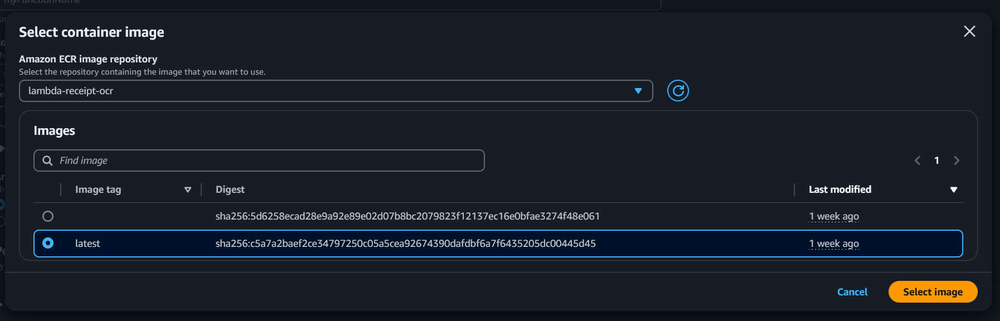
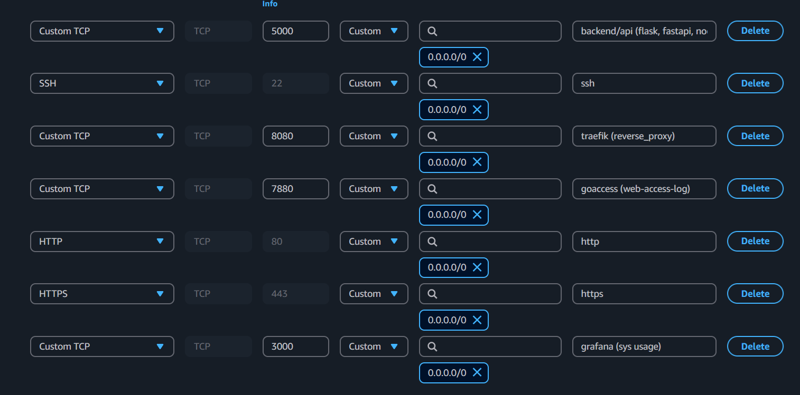
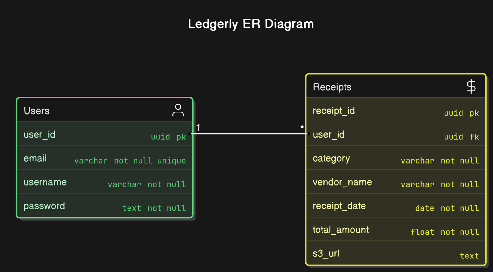

# AWS Setup

> [!NOTE]  
> The default architecture is based on AWS services, however all of the services and tooling can be setup within any other cloud platform of choice or self hosted locally as well if required.

All the services except S3 must be setup within the same region in AWS. 

All the services and configurations below adhere to the `AWS Free Tier` for a brand new account upto 12 months.

## ECR

AWS Elastic Container Registry will be used to host the container images to be run on AWS Lambda.

> [!NOTE]  
> AWS Lambda can only run images hosted on private registries in ECR.

- Go to Private registry > Repositories > Create Repository.
- Provide a repo namespace and name and keep the rest as default
- Once the repository is created, select it from the Repositories and go to Actions > Permissions.
- Under Permissions click on Edit Policy JSON and paste the below policy.

```json
{
  "Version": "2012-10-17",
  "Statement": [
    {
      "Sid": "LambdaECRImageRetrievalPolicy",
      "Effect": "Allow",
      "Principal": {
        "Service": "lambda.amazonaws.com"
      },
      "Action": [
        "ecr:BatchGetImage",
        "ecr:GetDownloadUrlForLayer"
      ]
    }
  ]
}

```
- On the Repositories tab and note View push commands for the respective platform to use with Docker during local development.
- Replace the S3 configuration in `services/receipt-ocr/handler.py` on line 40 according to the instructions in the comments.
- Build the image for `services/receipt-ocr` using Docker locally as `lambda-receipt-ocr:latest` and push it to the ECR repository just created.

## RDS

AWS RDS with PostgreSQL will serve as the primary database for storing user and receipt data for our application.

- Go to Databases > Create Database > Standard Create.
- Select PostgreSQL. Under Engine Version, choose PostgreSQL 17.2-R1.
- Under Templates, choose Free Tier.
- Under Settings, provide a name for the database under DB Instance identifier. 
- Create the Master Username and Master Password.
- Under Connectivity, choose Yes under Public Access
- Choose Create new under VPC Security Group (firewall) and provide a name.

Database Connection Endpoint: `[database-name].abcdef123456.[region].rds.amazonaws.com`


## Lambda

AWS Lambda will be used for running the container image for the `services/receipt-ocr` application in a serverless environment.

- Create a Function > Container Image.
- Provide a function name. Under Container Image URI > Browse Images choose the ECR repository created earlier and select the image tagged as latest.

  

- Under architecture choose x86_64 and leave the rest as default. Choose Create function.

### Configuration

Under General configuration change the defaults as below:
  - `Memory` - 512MB
  - `Timeout` - 30 sec

### Permissions

- Under Permissions > Execution Role Name, click the role to redirect to IAM. 
- In the IAM console, under Permission Policies > Add Permissions > Create Inline Policies.
Switch to JSON mode and paste the below policy. Then click Create.

  ```json
  {
      "Version": "2012-10-17",
      "Statement": [
          {
              "Sid": "VisualEditor0",
              "Effect": "Allow",
              "Action": [
                  "s3:GetObjectAcl",
                  "s3:GetObject",
                  "s3:GetObjectAttributes"
              ],
              "Resource": [
                  "arn:aws:s3:*:replace-account-id:accesspoint/*",
                  "arn:aws:s3:::replace-bucket-name/*"
              ]
          }
      ]
  }
  ```
- Again, go to Add Permissions > Attach policies. 
- Choose `AWSLambdaVPCAccessExecutionPermissions` from the list > Add permissions. 

### Environment

Go to Environment Variables > Edit. Add the following variables required by the application.

- `API_KEY` - [Gemini API KEY]
- `DB_HOST` - [Connection String for the Database (RDS/Docker/etc)]
- `DB_PASS` - [Database Password]
- `DB_USER` - [Database Username]
- `S3_ENDPOINT` - [S3 Bucket URL of the form https://bucket-name.s3.region.amazonaws.com/]

## S3

AWS S3 will be utilized for encrypted storage and hosting of user's receipt images.

- Create a new bucket. Choose a name and select ACLs enabled under Object Ownership.
- Under Block all public settings for this bucket, disable Block All public Access.
- After bucket creation, go to Properties > Event Notifications > Create Event Notification.
- Provide a name and under Event Types, choose All object create events.
- Under Destination select Lambda function > Choose from your Lambda functions > Select the function created in <a href="#lambda">Lambda</a> section.

## EC2

AWS EC2 will be used for provisioning a virtual machine for running Docker containers of the application and various services.

Go to Instances > Launch Instances. Create an EC2 instance with the following specs:

- `OS Image:` Ubuntu Server 24.04 LTS (64-bit x86)
- `Instance Type:` t2.micro
- `Key Pair:` Create a new .pem key to use with OpenSSH locally
- `VPC:` default
- `Security Group:` Allow SSH from Anywhere
- `Storage:` 15GB

Once the Instance is Running and passed all system reachability checks, select Instance > Security > Security Details.

### Inbound Rules

- Go to Security Groups > Inbound Rules > Edit Inbound Rules.
- Add the below rules and click Save Rules.

  

### IAM Role

- Go to Instances > Actions > Security > Modify IAM Role > Create New IAM Role.
- Under Create Role choose AWS Service as Trusted Entity Type and EC2 under Use case.
- Under Permissions select `AmazonS3FullAccess`. Provide a role name and choose Create Role.
- Go back to Modify IAM Role > Choose the Role just created above from IAM role dropdown > Click Update IAM role.
---

## Database

The default architecture utilizes the free `AWS RDS t4g.micro` instance for hosting the Postgres database. As an alternative a `postgres` container can also be run within `Docker` on an `EC2` machine for the same utility. 

### Default Credentials
`username` - user

`pass` - pass

`DB Name` - testdb

`port` - 5432

`host` - EC2 public IP or RDS Connection URL

### Creating tables



Copy the contents of `deployment/tables.sql` into the SQL Query Editor within any database tool after connecting to the RDS database.

# Remote Backend Setup

1. Clone the repository locally. Add the environment variables as per the `.env.example` into the `.env` file within the `deployment` directory.

```bash
git clone https://github.com/sankalpx5/expensa.git
cd expensa/deployment
touch .env
```

2. Add the following variables required by the services.

- `API_KEY` - [Gemini API KEY]
- `POSTGRES_HOST` - [Connection String for the Database (RDS/Docker/etc)]
- `POSTGRES_PASS` - [Database Password]
- `POSTGRES_USER` - [Database Username]
- `S3_ENDPOINT` - [S3 Bucket URL of the form https://bucket-name.s3.region.amazonaws.com/]
- `S3_BUCKET` - [S3 Bucket name]


# Usage

**Set up AWS credentials**:
   Ensure you have your AWS credentials configured. You can do this by setting environment variables or using the AWS CLI.

1. Run the containers with `Docker Compose`.

```
docker compose -f docker-compose.cloud.yml up --build --pull missing -d
```


### Routes

Backend API accessible at `http://ec2-subdomain.com:5000`